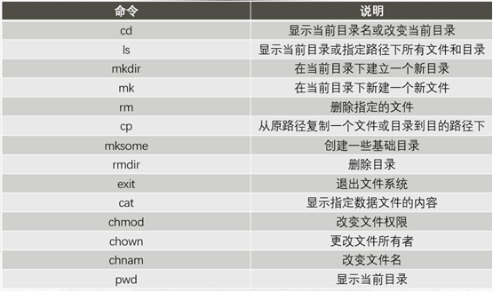
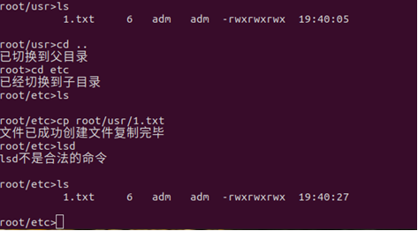
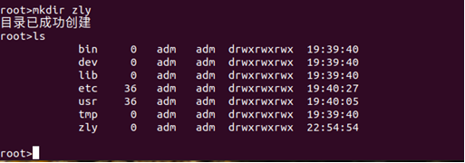
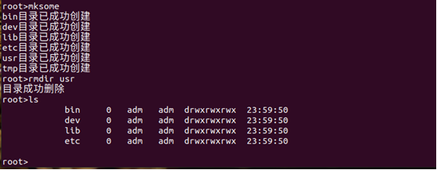
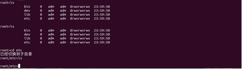
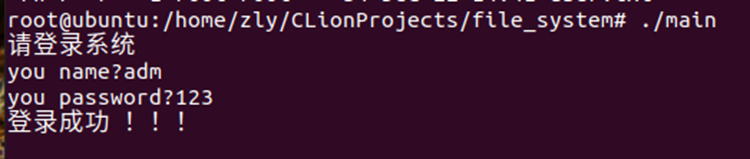

## 说明
1. 每一个block占512字节，用“\n"隔开，共514B
2. 0#超级块，1-10#为索引节点，每个索引节点64B, 共80个索引节点
3. 空闲块管理：采用成组链接法管理，每组为为10块，12#~99#分为9组，每组的最后一个磁盘块里存放下一组的磁盘号信息。最后一组只要8块。
4. 空闲索引节点：采用混合索引式文件结构，索引节点包括6项，4个直接块号，一个一次间址，一个两次间址

## 运行
首先将config.h的文件路径进行修改成当前项目运行的路径
运行
```c++
g++ main.cpp -o main
```
```c++
./main
```
## 设计及结果图


创建文件

删除文件

复制












